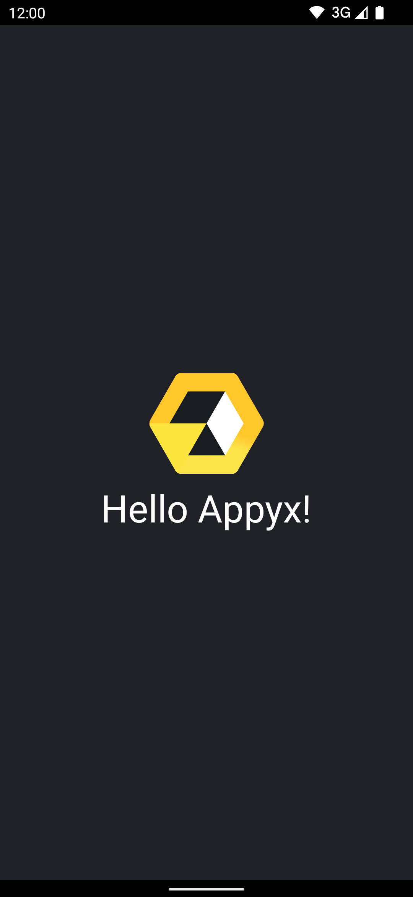

summary: Hello World with Appyx
id: appyx-hello-world
categories: Introduction
tags: Appyx
status: WIP
authors: Vlad

# Hello World with Appyx

<!-- ------------------------ -->
## Getting started
Duration: 1

### Before you begin

[Appyx](https://bumble-tech.github.io/appyx/) is a model-driven-navigation library for Jetpack Compose.

This tutorial will walk you through creating a Hello World app using Appyx.

If you're already familiar with Appyx, you can skip this codelab entirely – just clone the [starter-kit](https://github.com/bumble-tech/appyx-starter-kit) and start building awesome apps!


### What you'll do

1. Setup Appyx in your project
2. Create a root Node with a hello world view
3. Connect this root Node into your Activity


### What you'll build




### Access the code

Clone the repo and open the `HelloAppyx` project.

```
git clone git@github.com:bumble-tech/appyx-codelabs.git

```


### How the codelab is structured

This tutorial and the `TODOs` will help you build your first Appyx project.

If at any point you're feeling stuck, you can always check out the solution inside the project.

<aside>The <strong>appyx-codelabs</strong> repo contains starter code for all codelabs in the pathway.<br/>
For this codelab, use the <strong>HelloAppyx</strong> project.
<ul>
<li><strong>HelloAppyx</strong> — Project that contains the starter and finished code for this codelab.<li>
</ul>
<br/>
The project contains two modules:<br/>
<ul>
<li><strong>app</strong> – Contains the starter code for this project. Make your changes here to complete the codelab.</li>
<li><strong>solution</strong> – Contains the solution to this codelab.</li>
</ul>
</aside>


### Add Appyx to your project

You can refer to our [Changelog](https://bumble-tech.github.io/appyx/releases/changelog/) for the latest release version.

If you're using `build.gradle.kts`:
```
implementation("com.bumble.appyx:core:{version}")

```

For `build.gradle` you can use:
```
implementation "com.bumble.appyx:core:{version}"

```


<!-- ------------------------ -->
## Create a RootNode
Duration: 1

Nodes are the fundamental building blocks in Appyx. 

We'll learn more about them in subsequent codelabs, for now we'll only leverage that they have `@Composable` views.    

Let's implement our `RootNode`:


1. Open the `RootNode.kt` file. 
2. Change it so that it inherits from `Node`.
3. Add `buildContext: BuildContext` on the constructor and pass it to the `Node`.

```
class RootNode(
    buildContext: BuildContext
) : Node(
    buildContext = buildContext
) {
    ...
}

```

We'll override the `@Composable` function `View` to say hello:

```
@Composable
override fun View(modifier: Modifier) {
    Column(
        verticalArrangement = Arrangement.Center,
        horizontalAlignment = Alignment.CenterHorizontally,
        modifier = Modifier
            .fillMaxSize()
            .background(color = MaterialTheme.colors.background),
    ) {
        Image(
            painter = painterResource(id = R.drawable.logo),
            contentDescription = "Appyx Logo",
            modifier = Modifier.padding(bottom = 8.dp)
        )
        Text(
            text = "Hello Appyx!",
            fontSize = 36.sp,
            color = MaterialTheme.colors.onBackground
        )
    }
}

```

<!-- ------------------------ -->
## Host your RootNode
Duration: 1

Let's now host our newly created `RootNode` inside the `MainActivity`.

To use the `NodeHost` inside your activity you'll need to inherit from `NodeActivity`.

```
class MainActivity : NodeActivity() {
    ...
}
```

Let's change the `onCreate` method to host our `RootNode`:

```
    override fun onCreate(savedInstanceState: Bundle?) {
        super.onCreate(savedInstanceState)
        setContent {
            HelloAppyxTheme {
                NodeHost(integrationPoint = appyxIntegrationPoint) {
                    RootNode(it)
                }
            }
        }
    }
```

And we're done.


<!-- ------------------------ -->
## Launch
Duration: 1

Launch your app! It should look like this:


<!-- ------------------------ -->
## Where to go from here
Duration: 0

🎉 Congrats for completing this codelab! 🎉

Check out other code labs to start using the more advanced features of Appyx!

For more information on Nodes you can check out the [Structuring your app navigation](https://bumble-tech.github.io/appyx/apps/structure/) section on the project page.
