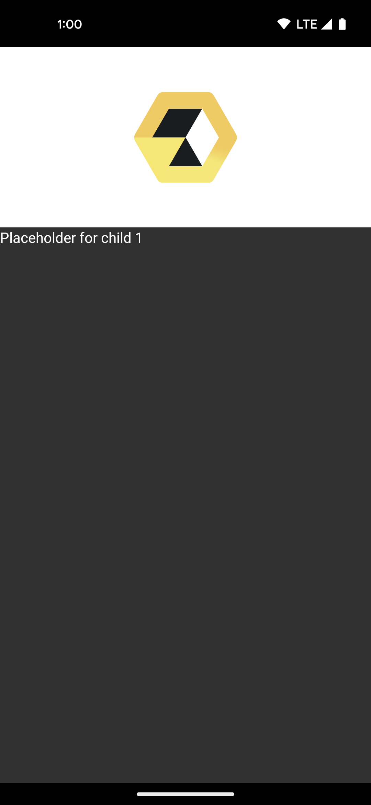
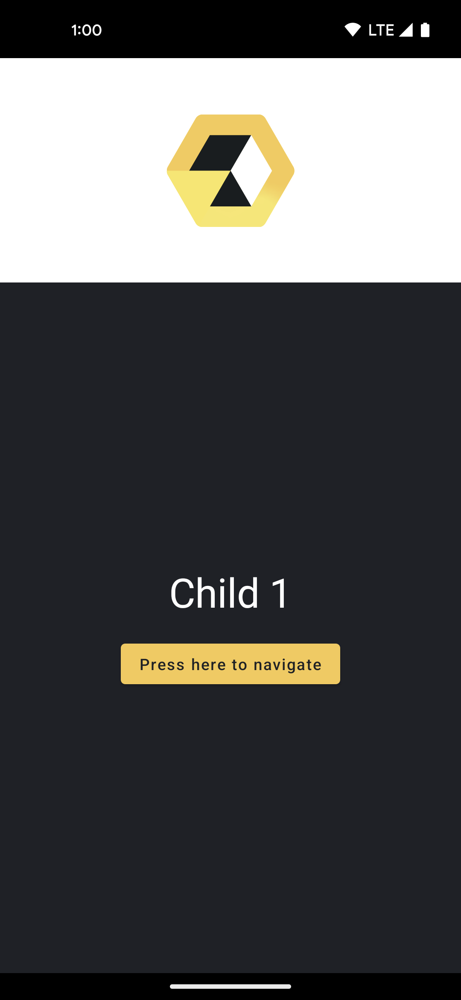
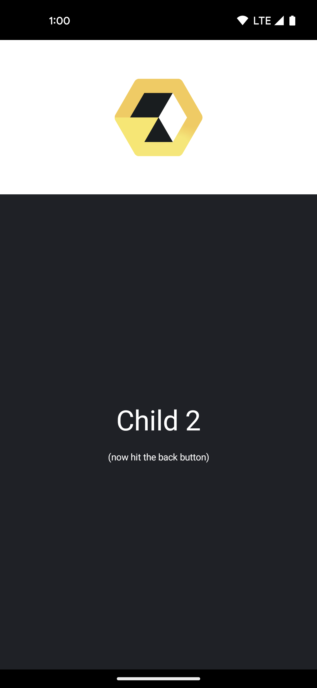

summary: Appyx Navigation
id: appyx-navigation
categories: Navigation
tags: Appyx
status: WIP
authors: Vlad

# Navigation with Appyx


<!-- ------------------------ -->
## Getting started
Duration: 1

### Before you begin

In the previous [codelab](https://bumble-tech.github.io/appyx-codelabs/appyx-hello-world) we've built a simple app using Appyx.
We're going to extend that and add navigation.


### What you'll do

1. Create a `ParentNode` that will have 2 child nodes
2. Add a `NavModel` to control navigation
3. Add transitions


### What you'll build


### Access the code

Clone the repo and open the `SimpleApp` project.

```
git clone git@github.com:bumble-tech/appyx-codelabs.git

```

This tutorial and the `TODOs` will help you build a simple app where we'll navigate from one screen to another.

If at any point you're feeling stuck, you can always check out the solution inside the project.

<aside>The <strong>appyx-codelabs</strong> repo contains starter code for all codelabs in the pathway.<br/>
For this codelab, use the <strong>SimpleApp</strong> project.
<ul>
<li><strong>SimpleApp</strong> — Project that contains the starter and finished code for this codelab.<li>
</ul>
<br/>
The project contains two modules:<br/>
<ul>
<li><strong>app</strong> – Contains the starter code for this project. Make your changes here to complete the codelab.</li>
<li><strong>solution</strong> – Contains the solution to this codelab.</li>
</ul>
</aside>

You can refer to our [Changelog](https://bumble-tech.github.io/appyx/releases/changelog/) for the latest release version.


<!-- ------------------------ -->
## Add a parent node
Duration: 1

Relevant pages from the Appyx project page:

- [Structuring your app navigation](https://bumble-tech.github.io/appyx/apps/structure/)
- [Composable navigation](https://bumble-tech.github.io/appyx/navigation/composable-navigation/)

If you run the `app` now, it just shows a screen that's built with Appyx.
This isn't very interesting, let's add more so we can understand how navigation works with Appyx.

### Defining navigation targets

We define the possible navigation targets using a `sealed class` inside our `RootNode`.

```
sealed class NavTarget {
    object Child1 : NavTarget()
    object Child2 : NavTarget()
}

```

Next we'll change our `RootNode` to inherit from a `ParentNode` instead of a simple `Node`.

```
class RootNode(
    buildContext: BuildContext
) : ParentNode<RootNode.NavTarget>(
    buildContext = buildContext,
    navModel = TODO("We'll add this is the following steps") 
) {
    ...
}

```

This will allow it to have a `navModel`, and actually change its own navigation destinations.


### Resolving navigation targets

`ParentNode` expects us to implement the abstract method `resolve`. This is the way we associate our navigation targets to actual `Node` instances.

The good news is we don't even need another `Node` – we can use simple placeholders until we build one. 

Let's use the `node(buildContext) { modifier -> ...}` method to do that as a first step – we'll soon make it more appealing!

```
override fun resolve(navTarget: NavTarget, buildContext: BuildContext) =
    when (navTarget) {
        is RootNode.NavTarget.Child1 -> node(buildContext) {
            Text(
                text = "Placeholder for child 1",
                color = MaterialTheme.colors.onBackground
            )
        }
        is RootNode.NavTarget.Child2 -> node(buildContext) {
            Text(
                text = "Placeholder for child 2",
                color = MaterialTheme.colors.onBackground
            )
        }
    }

```


<!-- ------------------------ -->
## Add a back stack
Duration: 1

Relevant pages from the Appyx project page:

- [Navigation models](https://bumble-tech.github.io/appyx/navmodel/)
- [BackStack](https://bumble-tech.github.io/appyx/navmodel/backstack/)

This project wouldn't compile just yet. `ParentNode` expects us to pass an instance of a `NavModel`.
`NavModel` is the main point of control when we add children and want to switch between them.

We'll use a familiar `NavModel`, a `BackStack`.

In the previous step we added a `TODO()`, we'll address it now:

```
class RootNode(
    buildContext: BuildContext,
    // Add the following block.
    // Feel free to use static imports to make it shorter!
    private val backStack: BackStack<RootNode.NavTarget> = BackStack(
        initialElement = RootNode.NavTarget.Child1,
        savedStateMap = buildContext.savedStateMap
    )
) : ParentNode<RootNode.NavTarget>(
    buildContext = buildContext,
    navModel = backStack // <-- replace the TODO() with this
) {
    ...
}

```

We can now use the back stack's API to add, replace and pop children.

Our `ParentNode` has a back stack now but in order to make use of it, we'll need to add it to the composition.
We'll modify our `View` function like so:

```
@Composable
override fun View(modifier: Modifier) {
    Column(
        verticalArrangement = Arrangement.Center,
        horizontalAlignment = Alignment.CenterHorizontally,
        modifier = modifier
    ) {
        Box(
            contentAlignment = Alignment.Center,
            modifier = Modifier
                .height(200.dp)
                .fillMaxWidth()
                .background(color = if (isSystemInDarkTheme()) appyx_bright else appyx_dark)
        ) {
            Image(
                painter = painterResource(id = R.drawable.logo),
                contentDescription = "Appyx Logo",
                modifier = Modifier.padding(16.dp)
            )
        }
        // This will add the child nodes to the composition
        Children(
            navModel = backStack,
            modifier = Modifier.fillMaxSize()
        )
    }
}

```

Your app will look like this:



We can't navigate to the second child yet but don't worry we'll fix that in the next steps.


<!-- ------------------------ -->
## Improving the first child node
Duration: 1

Let's update our child nodes to look nicer. 

Open `Child1Node.kt`. We'll need to make this class inherit from `Node`.

Copy the following code, this will be the first screen in our app. Note that we have a button and a callback for triggering a back stack change soon. 

```
class Child1Node(
    buildContext: BuildContext,
    private val onButtonPressed: () -> Unit // <- This is how we'll trigger a change in the parent
) : Node(buildContext) {

    @Composable
    override fun View(modifier: Modifier) {
        Box(
            modifier = modifier
                .fillMaxSize()
                .background(color = MaterialTheme.colors.background)
        ) {
            Column(
                verticalArrangement = Arrangement.Center,
                horizontalAlignment = Alignment.CenterHorizontally,
                modifier = Modifier
                    .fillMaxSize()
                    .background(color = MaterialTheme.colors.background),
            ) {
                Text(
                    text = "Child 1",
                    fontSize = 36.sp,
                    color = MaterialTheme.colors.onBackground,
                    modifier = Modifier.padding(bottom = 16.dp)
                )
                Button(
                    onClick = { onButtonPressed() }, // <- Don't forget to use the callback
                    colors = ButtonDefaults.buttonColors(
                        backgroundColor = appyx_yellow1,
                        contentColor = appyx_dark
                    )
                ) {
                    Text(text = "Press here to navigate")
                }
            }
        }
    }
}

```

The first screen will look like this:




<!-- ------------------------ -->
## And the second

Open `Child2Node.kt`. We'll need to make this class inherit from `Node`.

Copy the following code, this will be the second screen in our app.

```
class Child2Node(buildContext: BuildContext) : Node(buildContext) {

    @Composable
    override fun View(modifier: Modifier) {
        Column(
            verticalArrangement = Arrangement.Center,
            horizontalAlignment = Alignment.CenterHorizontally,
            modifier = Modifier
                .fillMaxSize()
                .background(color = MaterialTheme.colors.background),
        ) {
            Text(
                text = "Child 2",
                fontSize = 36.sp,
                color = MaterialTheme.colors.onBackground,
                modifier = Modifier.padding(bottom = 16.dp)
            )
            Text(
                text = "(now hit the back button)",
                fontSize = 12.sp,
                color = MaterialTheme.colors.onBackground
            )
        }
    }
}

```

The second screen will look like this:




<!-- ------------------------ -->
## Connecting the dots
Duration: 1


Let's now use these newly created child nodes instead of the placeholders!

Simply update the `resolve` function in `RootNode`:

```
override fun resolve(
    navTarget: RootNode.NavTarget,
     buildContext: BuildContext
) =
    when (navTarget) {
        is Child1 -> Child1Node(buildContext) { backStack.push(Child2) }
        is Child2 -> Child2Node(buildContext)
    }

```

Note how we're finally passing the callback that will push the second child to the back stack when the button is pressed.


<!-- ------------------------ -->
## Adding transitions
Duration: 0

Relevant pages from the Appyx project page:

- [Transitions](https://bumble-tech.github.io/appyx/ui/transitions/)

As a first step let's add fading transitions! It's a one-liner:

```
Children(
    ...
    transitionHandler = rememberBackstackFader()
)

```

There are other transition handlers, such as `rememberBackstackSlider()` – you can supply a `transionSpec` in both cases: 
```
transitionHandler = rememberBackstackFader(transitionSpec = { spring() })

```

You can also create your own transitions easily. We'll cover this topic in another codelab.


<!-- ------------------------ -->
## Launch
Duration: 1

Launch your app! It should look like this:


<!-- ------------------------ -->
## Where to go from here
Duration: 0

🎉 Congrats for completing this codelab! 🎉

Check out the other code labs to learn more about Appyx.
